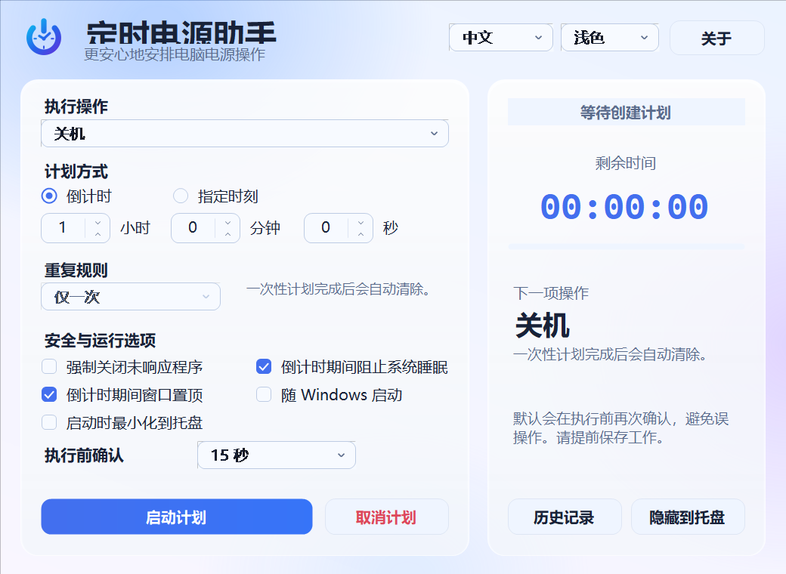

<div align="center">
  
  <h1>定时电源助手 · Zhutdown Timer</h1>
  <p>精致、可靠、完全离线的 Windows 定时电源工具</p>

  [](https://github.com/LONGSANGDONTSLEEP/ZhutdownTimer/actions/workflows/release.yml)
  [](https://github.com/LONGSANGDONTSLEEP/ZhutdownTimer/releases/latest)
  [](LICENSE)

  **中文** · [English](README_EN.md)
</div>



## 为什么选择它

- **六种系统操作**：关机、重启、睡眠、休眠、锁定、注销
- **雾面玻璃界面**：柔和环境光、半透明卡片与 Windows 11 Acrylic 效果
- **灵活计划**：倒计时或指定时刻；支持每天、工作日和周末重复
- **中英文切换**：无需重启，界面和托盘菜单即时切换
- **三种主题**：浅色、深色或跟随 Windows
- **安全防误触**：执行前 5/15/30/60 秒二次确认，可跳过当次计划
- **可靠恢复**：活动计划写入本地状态，程序重启后自动恢复；错过的一次性计划不会补执行
- **后台运行**：系统托盘、窗口置顶、防止睡眠、随 Windows 启动
- **可追溯**：最多保留 100 条本地历史记录，并写入诊断日志
- **完全离线**：没有网络请求、账户、广告或遥测

## 下载

前往 [GitHub Releases](https://github.com/LONGSANGDONTSLEEP/ZhutdownTimer/releases/latest)：

| 文件 | 适用场景 |
|---|---|
| `ZhutdownTimer-Setup-v2.1.0.exe` | 推荐。当前用户安装，带开始菜单和标准卸载入口，不需要管理员权限 |
| `ZhutdownTimer-portable-v2.1.0.zip` | 便携版。解压后直接运行 |
| `SHA256SUMS.txt` | 用于核验下载文件是否完整 |

系统要求：Windows 10/11，.NET Framework 4.8。安装程序与便携版功能相同。

> [!NOTE]
> 当前发布文件尚未使用商业代码签名证书，Windows SmartScreen 可能显示“未知发布者”。请只从本仓库 Releases 下载，并使用 `SHA256SUMS.txt` 核验文件完整性。

> [!WARNING]
> “强制关闭应用”可能造成未保存内容丢失。默认开启最终确认，但仍请在计划执行前保存工作。

## 使用说明

1. 选择关机、重启等操作。
2. 选择倒计时，或选择“指定时刻”并设置重复规则。
3. 按需开启防睡眠、开机自启和最终确认。
4. 点击“启动计划”。关闭窗口会隐藏到托盘，不会停止正在运行的计划。
5. 如需彻底退出，在托盘菜单中点击“退出”。

完全关机后，Windows 程序自身无法把电脑重新开机。如需定时开机，请使用主板 BIOS/UEFI 的 `RTC Alarm` / `Power On By RTC`，或由另一台设备发送 Wake-on-LAN。

## 命令行

```powershell
# 60 分钟后关机
ZhutdownTimer.exe --seconds 3600 --action shutdown --start

# 每个工作日 23:30 关机，后台运行
ZhutdownTimer.exe --time 23:30 --action shutdown --repeat weekdays --start --background

# 测试计划流程，不执行真实电源操作
ZhutdownTimer.exe --seconds 10 --action restart --start --dry-run
```

| 参数 | 值 |
|---|---|
| `--seconds` | 正整数秒数 |
| `--time` | `HH:mm` 或 `HH:mm:ss` |
| `--action` | `shutdown`、`restart`、`sleep`、`hibernate`、`lock`、`signout` |
| `--repeat` | `once`、`daily`、`weekdays`、`weekends` |
| `--lang` | `zh-CN`、`en-US` |
| `--theme` | `system`、`light`、`dark` |
| `--start` | 启动计划 |
| `--background` | 启动后隐藏到托盘 |
| `--force` | 强制关闭未响应应用 |
| `--dry-run` | 模拟执行，不调用系统电源操作 |

程序采用单实例模式；如果已经在运行，请从系统托盘打开现有窗口。

## 隐私与本地数据

程序不联网，也不收集遥测。设置、活动计划、历史记录与日志保存在 `%LocalAppData%\ZhutdownTimer`。

仅在你开启“随 Windows 启动”时，程序会写入当前用户的 `HKCU\Software\Microsoft\Windows\CurrentVersion\Run`。卸载程序不会擅自删除历史记录；可以在“历史记录”窗口中打开数据目录并自行管理。

## 从源码构建

```powershell
.\tools\GenerateAssets.ps1   # 重新生成透明 PNG 与多尺寸 ICO
.\build.ps1                  # 输出 dist\ZhutdownTimer.exe
.\dist\ZhutdownTimer.exe --self-test
```

也可以使用 Visual Studio 打开 `ZhutdownTimer.sln`。CI 在 GitHub 官方 `windows-2025` 镜像上构建、执行自检、编译 Inno Setup 安装程序，并对静默安装后的程序再次自检。

详细验证项目见 [测试说明](docs/TESTING.md)，安全问题报告方式见 [SECURITY.md](SECURITY.md)。

## 灵感与许可

产品思路受到 [Shutdown Timer Classic](https://github.com/lukaslangrock/ShutdownTimerClassic) 启发；本项目的代码、双语界面、品牌图标和实现均独立完成。项目使用 [MIT License](LICENSE)。
