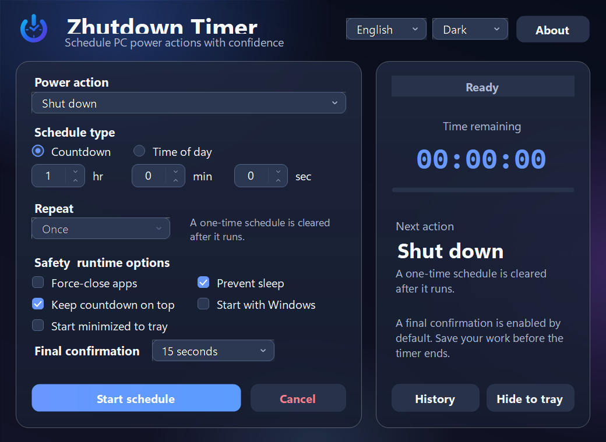

<div align="center">
  
  <h1>Zhutdown Timer</h1>
  <p>A polished, dependable and fully offline power scheduler for Windows</p>

  [](https://github.com/LONGSANGDONTSLEEP/ZhutdownTimer/actions/workflows/release.yml)
  [](https://github.com/LONGSANGDONTSLEEP/ZhutdownTimer/releases/latest)
  [](LICENSE)

  [中文](README.md) · **English**
</div>



## Highlights

- Shut down, restart, sleep, hibernate, lock or sign out
- Frosted-glass interface with ambient lighting, translucent cards and Windows 11 acrylic integration
- Countdown and time-of-day schedules, with daily/weekday/weekend recurrence
- Instant Chinese/English switching
- Light, dark and system themes
- Optional 5/15/30/60-second final confirmation
- Persistent active schedules, safe missed-schedule handling and local history
- System tray, always-on-top, sleep prevention and start-with-Windows options
- No accounts, network access, ads or telemetry

## Download

Open [the latest GitHub Release](https://github.com/LONGSANGDONTSLEEP/ZhutdownTimer/releases/latest):

| File | Use |
|---|---|
| `ZhutdownTimer-Setup-v2.1.0.exe` | Recommended per-user installer with Start Menu and uninstall entries; no admin rights required |
| `ZhutdownTimer-portable-v2.1.0.zip` | Portable build; extract and run |
| `SHA256SUMS.txt` | SHA-256 integrity checks |

Requirements: Windows 10/11 and .NET Framework 4.8.

> [!NOTE]
> Release binaries are not yet signed with a commercial code-signing certificate, so Windows SmartScreen may show an “Unknown publisher” warning. Download only from this repository's Releases page and verify the file against `SHA256SUMS.txt`.

> [!WARNING]
> Force-closing applications can discard unsaved work. Final confirmation is enabled by default, but you should still save your work before a schedule runs.

## Command line

```powershell
ZhutdownTimer.exe --seconds 3600 --action shutdown --start
ZhutdownTimer.exe --time 23:30 --action shutdown --repeat weekdays --start --background
ZhutdownTimer.exe --seconds 10 --action restart --start --dry-run
```

Options include `--seconds`, `--time`, `--action`, `--repeat`, `--lang`, `--theme`, `--start`, `--background`, `--force` and `--dry-run`. The app uses a single-instance model; reopen it from the tray if it is already running.

## Privacy

Zhutdown Timer does not make network requests or collect telemetry. Local state and logs live in `%LocalAppData%\ZhutdownTimer`. The current-user Windows Run registry key is changed only when you explicitly enable “Start with Windows.”

## Build

```powershell
.\tools\GenerateAssets.ps1
.\build.ps1
.\dist\ZhutdownTimer.exe --self-test
```

See [TESTING.md](docs/TESTING.md), [SECURITY.md](SECURITY.md) and the [Chinese README](README.md) for complete documentation.

## Credits and license

The product concept was inspired by [Shutdown Timer Classic](https://github.com/lukaslangrock/ShutdownTimerClassic). Zhutdown Timer's code, bilingual interface, branding and implementation are independently authored. Licensed under the [MIT License](LICENSE).
